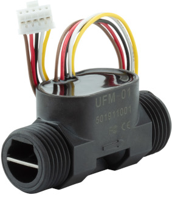
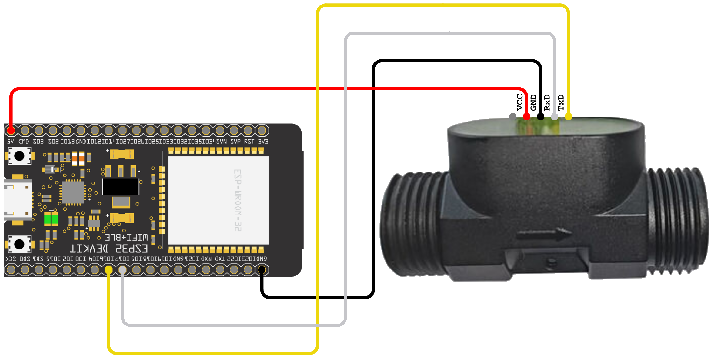
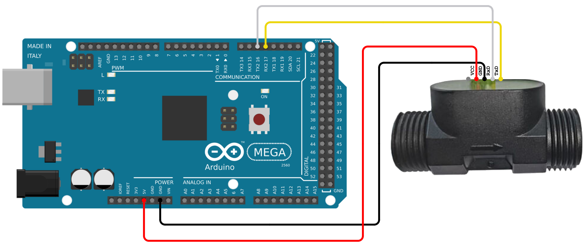
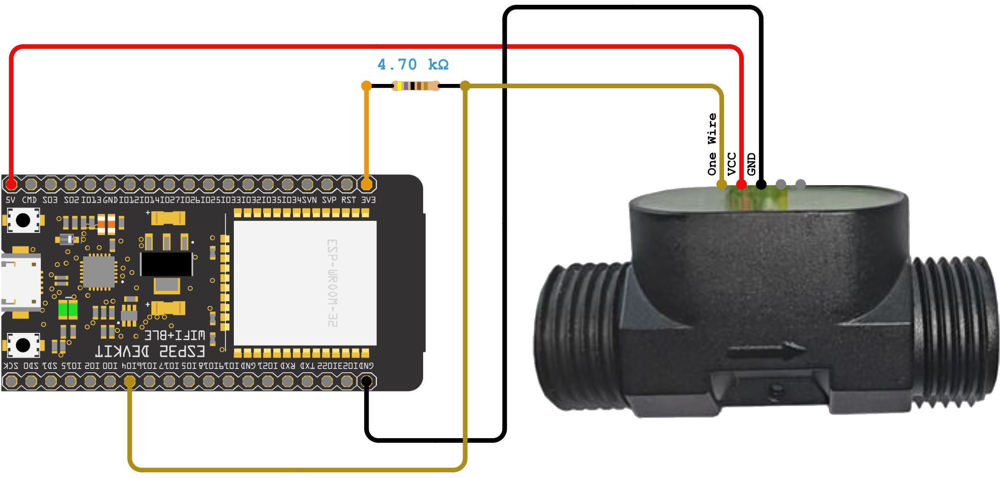
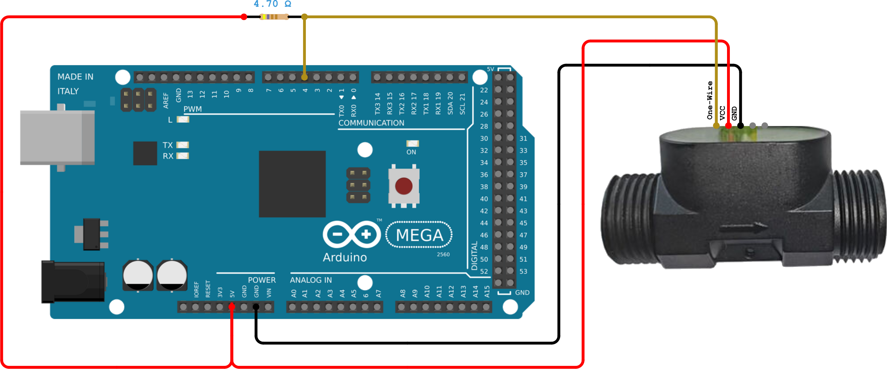

# ScioSense UFM01 Embedded Library
Arduino library for UFM01 ultrasonic flow sensing module through one-wire and UART from ScioSense.

The UFM-01 is a complete unit including the sensor electronics, spool piece, connectors with standard ½” thread, and a cable connector supporting single-wire and UART interfaces.

## Links
* [Further information about the UFM01](https://www.sciosense.com/ufm-01-ultrasonic-flow-sensing-module/)
* [Datasheet](https://www.sciosense.com/wp-content/uploads/2024/07/UFM-01-Datasheet.pdf)
* Buy the UFM01 on [Mouser](https://mou.sr/4incAVz) or [Digikey](https://www.digikey.nl/en/products/detail/sciosense/UFM-01/21700500)
* Buy the UFM01 evaluation kit on [Mouser](https://mou.sr/3F3QBVt)
 
## Prerequisites
It is assumed that
 - The Arduino IDE has been installed.
   If not, refer to "Install the Arduino Desktop IDE" on the
   [Arduino site](https://www.arduino.cc/en/Guide/HomePage).
- The library directory is at its default location. Normally this is `C:\Users\[your_username]\Documents\Arduino\libraries`.

## Installation

### Installation via Arduino Library Manager (coming soon)
- In the Arduino IDE, navigate to the Arduino Library Manager on the left side (or, alternatively, select Sketch > 
Include Library > Manage Libraries...)
- Search for `ScioSense_UFM01`
- Select the library from the search results and press `Install`

### Manual installation
- Download the code from this repository via "Download ZIP".
- In Arduino IDE, select Sketch > Include Library > Add .ZIP library... and browse to the just downloaded ZIP file.
- When the IDE is ready this README.md should be located at `C:\Users\[your_username]\Documents\Arduino\libraries\ScioSense_UFM01\README.md`.

## Wiring

### General
Please make sure that you use the correct supply voltage: The UFM-01 runs at VDD = 5V.

### Example with ESP32 or Arduino Mega (UART)
This example shows how to wire an ESP32 with a UFM-01 to communicate through UART. For other platforms a hardware UART port has to be used. The SoftwareSerial library does not support Even data parity and therefore cannot be used with the UFM-01.

|  UFM-01   | ESP32 | Arduino Mega |
|:---------:|:-----:|:------------:|
|  One-Wire |  -    |      -       |
|  VCC      |  5V   |      5V      |
|  GND      |  GND  |      GND     |
|  UART_RX  |  17   |      16      |
|  UART_TX  |  16   |      17      |

### Example with ESP32 or Arduino Mega (one wire)
This example shows how to wire an ESP32 with a UFM-01 to communicate through One Wire. A pull-up of 4.7kΩ must be connected to 3.3V for the ESP32, for other platforms it must be connected to the supply voltage of the micro-controller. The library works with [Paul Stoffregen's OneWire library (v>=2.3.8)](https://github.com/PaulStoffregen/OneWire), which is installed automatically if the UFM-01 library was downloaded through the Arduino IDE.

|  UFM-01   | ESP32 | Arduino Mega |
|:---------:|:-----:|:------------:|
|  One-Wire |  4    |      4       |
|  VCC      |  5V   |      5V      |
|  GND      |  GND  |      GND     |
|  UART_RX  |  -    |      -       |
|  UART_TX  |  -    |      -       |

## Build an example
To build an example sketch
 - (Re)start Arduino.
 - Open File > Examples > Examples from Custom Libraries > ScioSense_UFM01 > 01_Basic (or any other of the provided 
examples you wish to run)
 - Make sure Tools > Board lists the correct board.
 - Select Sketch > Verify/Compile.

## Contributing
Contributions in the form of issue opening or creating pull requests are very welcome!

### ScioSense is a Joint Venture of ams AG 
